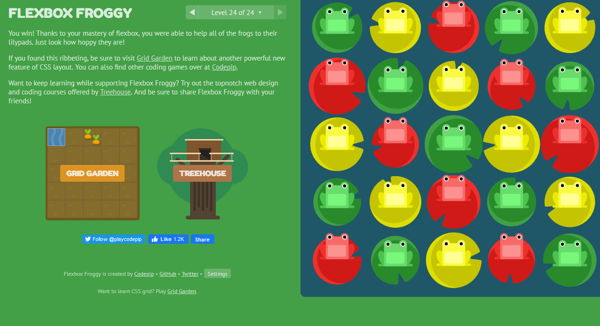

# Javascript

## Mustache

Mustache is just a logic-less template syntax, basically a dummy down way to type copy in JS. Essential its takes the template and the input data(json)then using a templating engine which is the mustache library to output on the template.

example   

```Javascript
var nameObject = {"name": "Sherlynn"}
res.render('hello', nameObject)
```
the hello in the second line in the parameter is a string which in going to be rendered, the nameObjest is the var above which is set to an json object type, so will also be render(is muplitple object, it will try to render all data types.)


# CSS

## Flexbox
```CSS
.container{
  display:flex;
} 
```  

This rule is set on the container given all of its childs element flex properties. 

```CSS
.container {
  flex-direction: row | row-reverse | column | column-reverse;
}
```  

Defines direction on the main x axis

- row (default): left to right in ltr; right to left in rtl
- row-reverse: right to left in ltr; left to right in rtl
- column: same as row but top to bottom
- column-reverse: same as row-reverse but bottom to top  

Justify-content is for horizontel alignment while  xaxis
align-items is for vertical alignment  yaxis

[Use this link for more rules for flexbox and image examples](https://css-tricks.com/snippets/css/a-guide-to-flexbox/)  



[Use this site for redo the course from the picture above](https://flexboxfroggy.com/)  


[<===](../README.md)