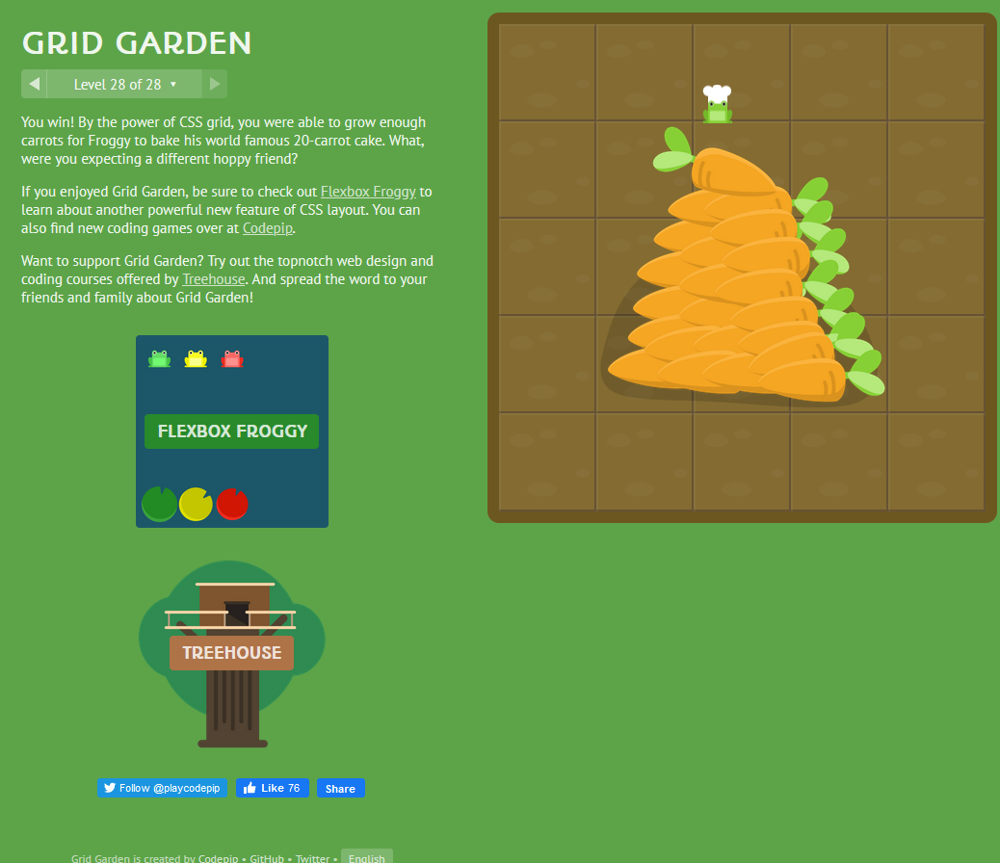

# CSS

## Grid

To get started you have to define a container element as a grid with **display: grid**, set the column and row sizes with **grid-template-columns** and **grid-template-rows**, and then place its child elements into the grid with **grid-column** and **grid-row**. Similarly to flexbox, the source order of the grid items doesn’t matter. Your CSS can place them in any order, which makes it super easy to rearrange your grid with media queries. Imagine defining the layout of your entire page, and then completely rearranging it to accommodate a different screen width all with only a couple lines of CSS. Grid is one of the most powerful CSS modules ever introduced.  

## Grid Container
The element on which **display: grid** is applied. It’s the direct parent of all the grid items. In this example container is the grid container.

### Note:
float, display: inline-block, display: table-cell, vertical-align and column-* properties have no effect on a grid item.  

  

**Remember** use fr, essentially for fraction in your template if you  know your are going to divide section equally!!!  

[<==Back](../README.md)